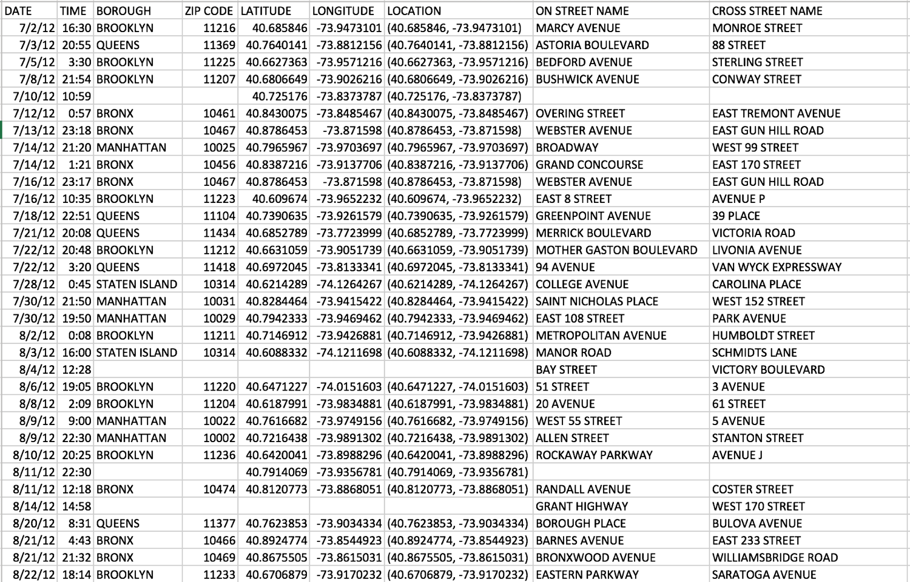
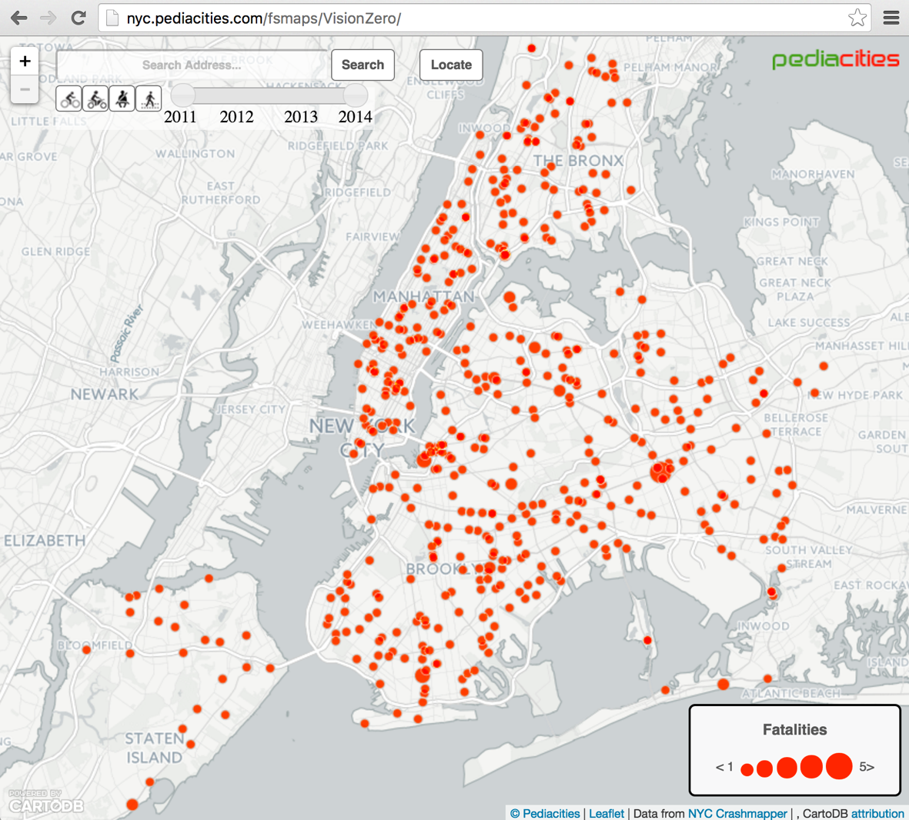
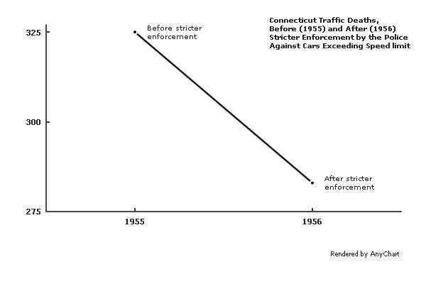
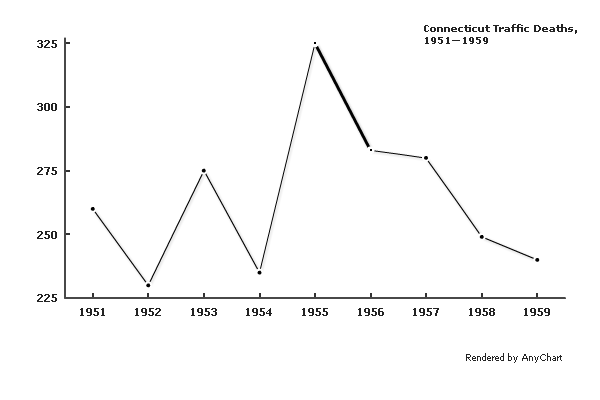
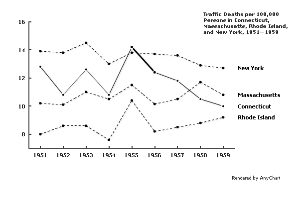
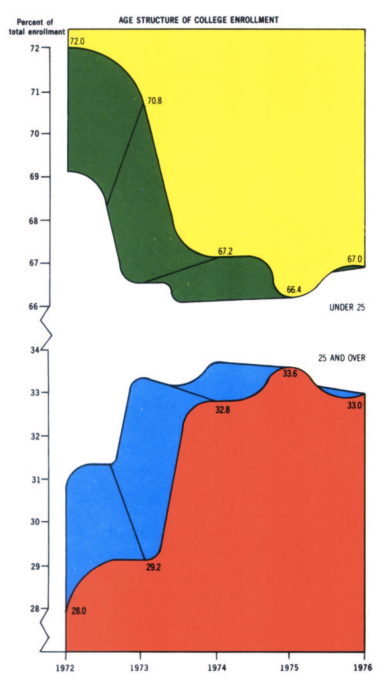
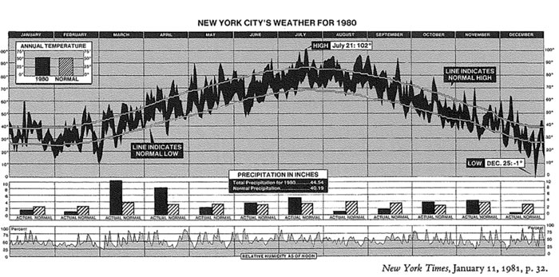
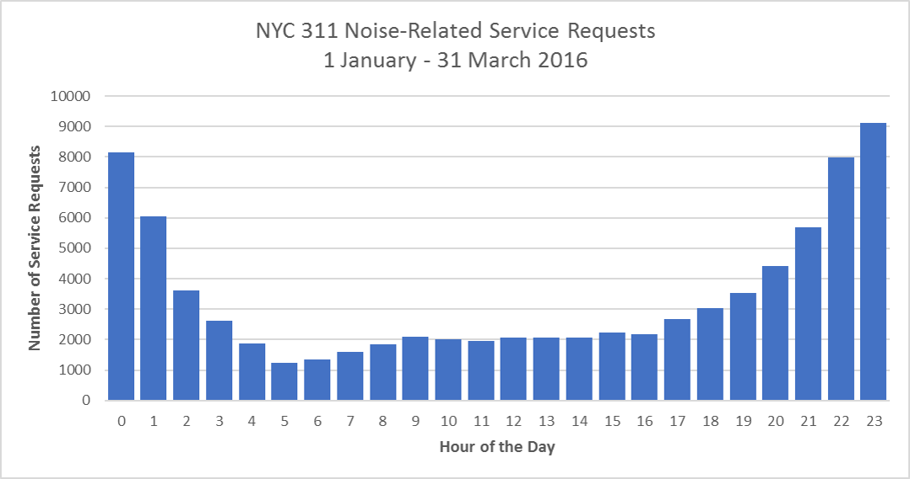

layout:true

  
  
Data Translation

  

    
    
      
      

--

class: center,middle

# Data Translation

- - -

## Facilitator: Richard Dunks

### Follow along at: 

#### See the code at: http://bit.ly/data-trans-code

<strong><strong>Data Translation</strong></strong> by <a xmlns:cc="http://creativecommons.org/ns#" href="http://www.datapolitan.com" property="cc:attributionName" rel="cc:attributionURL">Richard Dunks</a> is licensed under a <a rel="license" href="http://creativecommons.org/licenses/by-sa/4.0/">Creative Commons Attribution-ShareAlike 4.0 International License</a>

---

class:center,middle
# Welcome

---

# Introduction
???
+ Facilitators will cover the following skills: muting themselves, stopping their video, typing in chat box, raising their hand, sharing their screen

--

+ Background in sociology
--

+ Served in the US Army 2004 - 2009
--

+ DoD Contract Intelligence Analyst 2009 - 2012
--

+ 2014 CUSP Graduate
--

+ Intern at the Mayor's Office of Data Analytics
---

# Introduction

+ Started Datapolitan in June 2014 
--

+ Developed a training program in data analytics for city employees
--

+ Delivered over 250 learning events involving over 2,000 city employees around the US and Canada
--

+ Provide strategy consulting and project work to government agencies and non-profit organizations
--

+ Adjunct professor in the MPA program at Tulane University

---

# Data Translation
???
+ 

--

> Facts do not speak for themselves. They speak for or against competing theories. Facts divorced from theories or visions are mere isolated curiosities.
>
> - Thomas Sowell, _A Conflict of Visions_
--

## .center[Theories/Visions == Context]
---

# Giving Context
--

--

---

# Giving Context

---

# Giving Context

---

# Giving Context

---

# Giving Context

---

# Giving Context

---

class:center,middle
# The Role of Data Analysis

---

# What is Data?
--

+ Data tells a story about something that's happened
--

+ Can describe what happened directly or indirectly
--

---

# What is Analysis?
--

> Analysis is simply the pursuit of understanding, usually through detailed inspection or comparison
> 
> - [Carter Hewgley](https://www.linkedin.com/in/carterhewgley/)

---

# Final Thoughts
--

+ Data can tell a story, but doesn't speak for itself
--

+ Good "translation" is about telling a true and compelling story

---

# Contact Information
+ [Email me](mailto:richard[at]datapolitan[dot]com)
+ Check out [my website](https://wwww.datapolitan.com)
+ Connect on [Twitter](https://twitter.com/Datapolitan)
+ Connect on [LinkedIn](https://www.linkedin.com/in/richarddunks/)
+ Follow us on [Instagram](https://www.instagram.com/datapolitan/)

---

class:middle,center
# Thank You!

